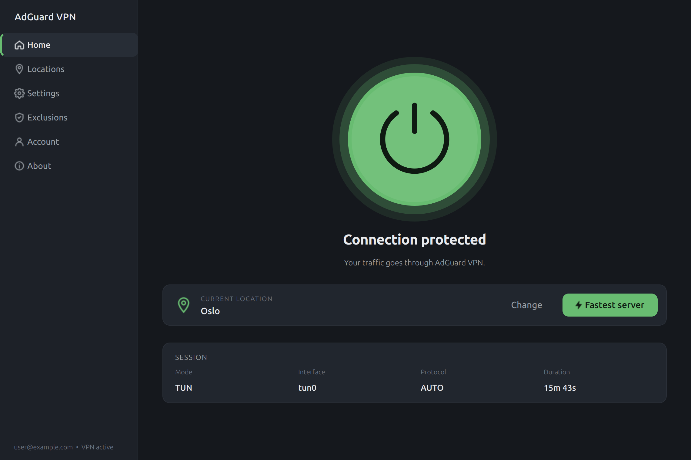
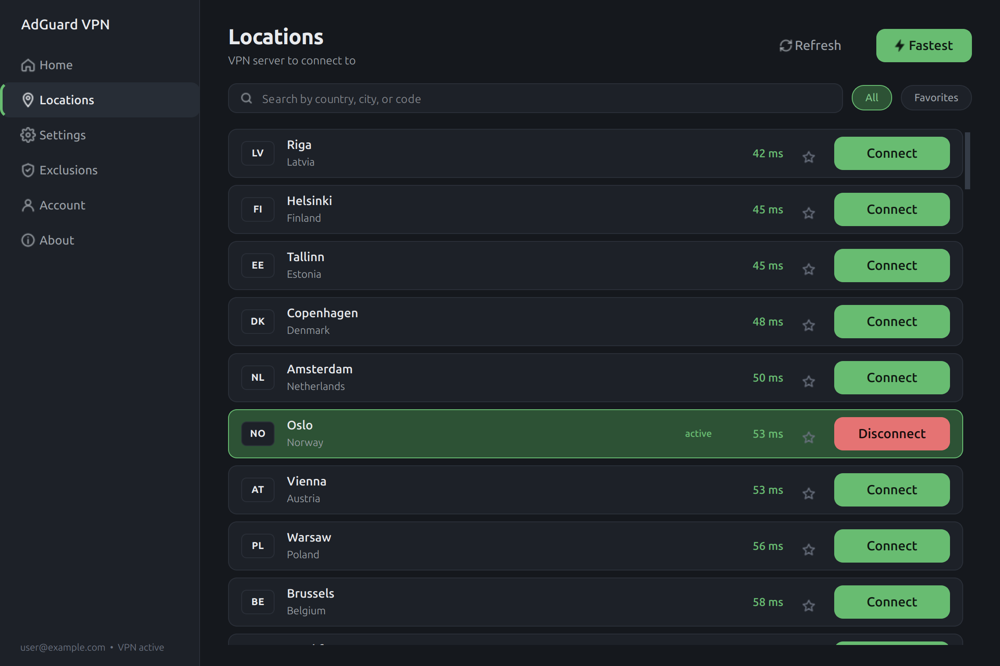
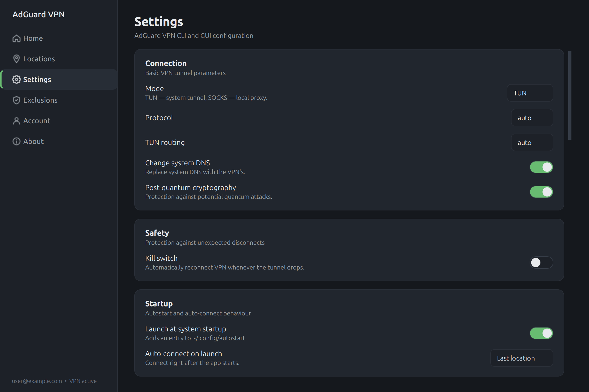
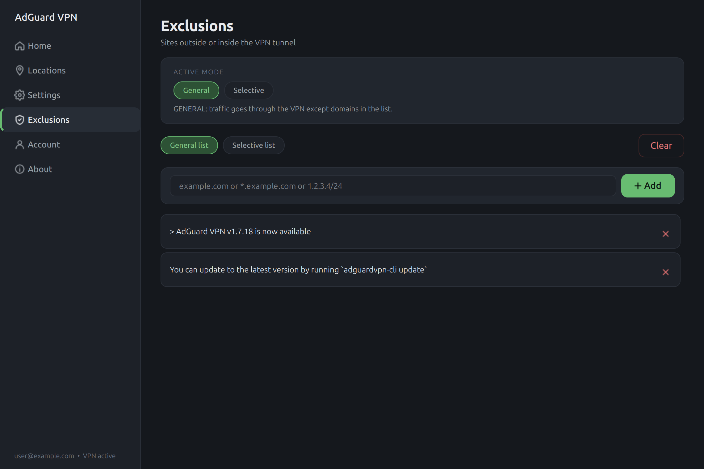
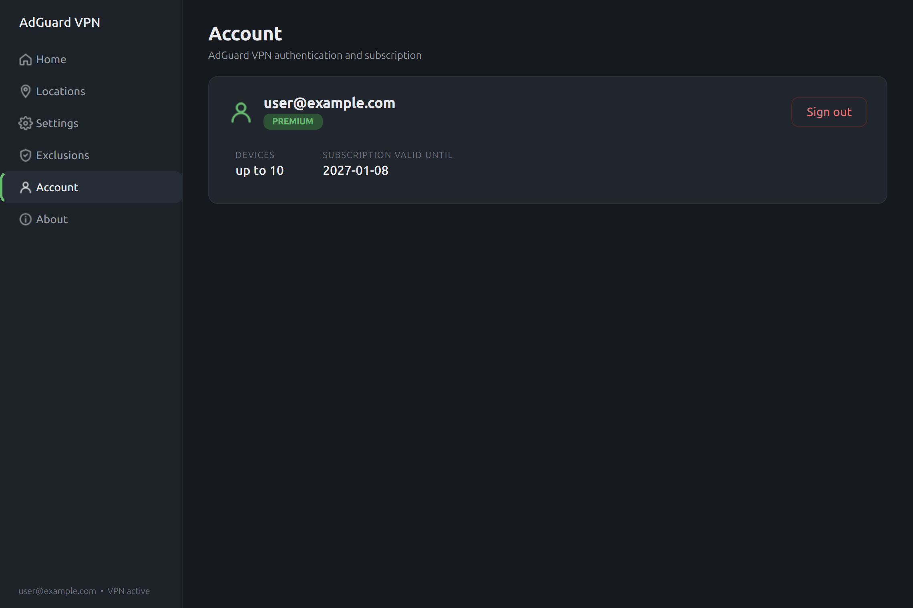
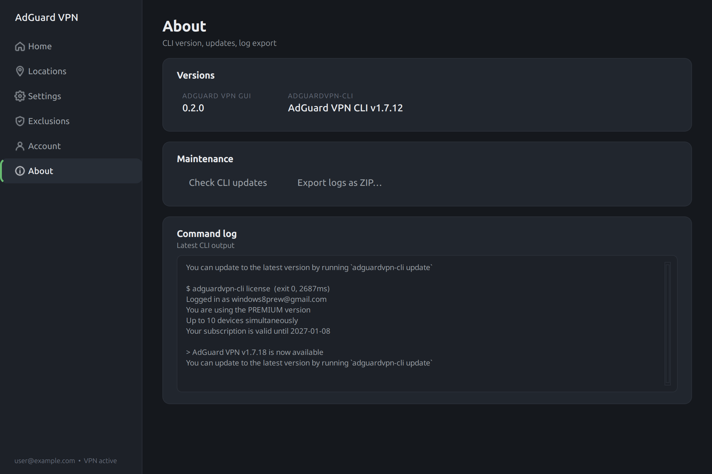

# AdGuard VPN GUI

> Unofficial modern desktop GUI for the official [`adguardvpn-cli`](https://github.com/AdguardTeam/AdGuardVPNCLI) on Linux.

[](LICENSE)
[](https://www.python.org/)
[](https://doc.qt.io/qtforpython-6/)
[](#)

## Why?

[`AdGuard VPN`](https://github.com/AdguardTeam/AdGuardVPNCLI) for Linux is CLI-first. This project adds a native desktop GUI:
tray icon, one-click connect, locations with ping, autostart, exclusions,
kill switch, and settings UI.

⚠️ Unofficial community project. Not affiliated with AdGuard Software Ltd.
Requires the official adguardvpn-cli to be installed and authenticated.

<p align="center">
  
</p>

## Features

- **One-click connect** — large circular Connect button with explicit
  `disconnected / connecting / connected / disconnecting / error` states,
  branded green glow when active.
- **Locations list** with live ping, country flag-badge, fuzzy search by
  country/city/ISO code, `All / Favorites` filter and per-row favorite
  toggle. The active location shows a red **Disconnect** button; pending
  rows get an amber pill with an iOS-style segmented spinner painted
  directly inside the button — no clunky banners.
- **Full coverage of CLI `config set-*`**: TUN/SOCKS mode, protocol
  (auto/http2/quic), TUN routing, system DNS, post-quantum, SOCKS
  host/port/auth, route script, update channel, telemetry, bound interface.
- **Kill switch** powered by the CLI's built-in `--boot` flag — the daemon
  reconnects indefinitely if the tunnel drops. No iptables, no sudo.
- **Autostart** via the standard `~/.config/autostart/adguard-gui.desktop`
  (works on GNOME / KDE / XFCE / Cinnamon).
- **Auto-connect on launch** — `Off / Last location / Fastest`.
- **System tray** with `Connect (fastest) / Disconnect / Open / Quit`;
  the icon colour reflects connection state. Closing the window minimises
  to tray.
- **Site exclusions** — switch general/selective mode, add/remove domains
  and CIDR ranges.
- **Single instance** via `QLockFile` — a second launch surfaces the
  existing window instead of starting a new process.
- **6 languages**: English, Русский, Deutsch, Español, Français, 中文.
  Switching is **live, no restart required**.
- **Session duration** is read from the real tun-interface creation time
  (`/sys/class/net/<iface>` mtime) — correct even if the CLI was already
  connected before the GUI started.

## Screenshots

| Home | Locations |
|---|---|
|  |  |

| Settings | Exclusions |
|---|---|
|  |  |

| Account | About |
|---|---|
|  |  |

## Requirements

- Linux with any Wayland/X11 desktop environment
- [`adguardvpn-cli`](https://github.com/AdguardTeam/AdGuardVPNCLI) installed
  and authenticated. The official installer sets `CAP_NET_ADMIN` on the
  binary, so the GUI never needs sudo.
- Python 3.10+
- PySide6 (Qt 6)

## Installation

The project ships native packaging for every major Linux family plus
universal formats (AppImage, Flatpak, Snap).

| Distribution                            | Package manager     | Command                                  |
|-----------------------------------------|---------------------|------------------------------------------|
| Debian, Ubuntu, Mint, Pop!_OS, Elementary | `apt` / `dpkg`     | `make deb && sudo apt install ./build/*.deb` |
| Fedora, RHEL, CentOS Stream, Alma, Rocky | `dnf` / `yum`       | `make rpm && sudo dnf install ./build/rpm/RPMS/noarch/*.rpm` |
| openSUSE, SLE                            | `zypper`            | `make rpm && sudo zypper install ./build/rpm/RPMS/noarch/*.rpm` |
| Arch, Manjaro, EndeavourOS               | `pacman` / `makepkg` | `make arch && sudo pacman -U build/*.pkg.tar.*` |
| Alpine                                   | `apk` / `abuild`    | `make alpine`                            |
| Void Linux                               | `xbps` / `xbps-src` | `make void` (see hint)                   |
| Gentoo                                   | `emerge` / ebuild   | `make gentoo` (drop into overlay)        |
| NixOS / Nix                              | `nix`               | `make nix` → `nix profile install ./packaging/nix#default` |
| Any distro (universal)                   | Flatpak             | `make flatpak && flatpak install ./build/*.flatpak` |
| Any distro (universal)                   | Snap                | `make snap && sudo snap install --dangerous ./build/*.snap` |
| Any distro (universal)                   | AppImage            | `make appimage && ./build/*.AppImage`    |

All build targets live in the root `Makefile`; per-distribution meta lives
under [`packaging/`](packaging/). See [`packaging/README.md`](packaging/README.md)
for prerequisites and CI tips.

### Manual install from sources

```bash
sudo make install                    # into /usr
sudo make install PREFIX=/usr/local  # or any prefix you like
```

`make uninstall` removes everything that `make install` placed.

### Run from the repository (development)

```bash
python3 -m venv .venv
.venv/bin/pip install -r requirements.txt
.venv/bin/python main.py
```

## Usage

After installation a desktop entry appears in your application menu under
*Network*; from a terminal just run `adguard-gui`. CLI flags:

- `--minimized` — start hidden in tray (used by the autostart entry).

GUI preferences live in `~/.config/adguard-gui/config.json`. VPN
configuration itself lives in `adguardvpn-cli` and is exposed through the
*Settings* page.

## Project layout

```
adguard_gui/         — application (PySide6)
  adapters/          — typed wrapper around adguardvpn-cli
  models/            — dataclasses + AppState (QObject with signals)
  parsers/           — text parsers (ANSI strip, status, license,
                       locations, config show, exclusions)
  services/          — CommandRunner, Poller, autostart manager
  storage/           — config.json (GUI-only prefs)
  ui/                — pages, widgets, tray, MainWindow, theme.py, i18n.py
assets/
  icons/             — master SVG + hicolor PNG set (16…512)
  screenshots/       — README screenshots
packaging/           — .desktop, debian/, rpm.spec, PKGBUILD
scripts/             — generate_icons.py
Makefile             — install / deb / rpm / icons / clean
```

## Architecture

A single `AppState` QObject holds the entire visible VPN state (`status`,
`license`, `locations`, `config`, `exclusions`) and emits signals when any
slice changes. `CommandRunner` runs `CliAdapter` calls on `QThreadPool`,
parses output and updates the state. UI pages subscribe to the signals
they care about — no UI page ever shells out to the CLI directly.

Changing the language rebuilds `MainWindow._build_ui()` and calls
`TrayIcon._retranslate()` — the app is fully translatable without a
restart.

## Localization

English strings are the canonical keys (`tr("Home")`). Translations live
in `adguard_gui/i18n.py` as a `TRANSLATIONS[lang]` dict. Missing keys
gracefully fall back to the English original.

## Contributing

Issues and pull requests are welcome. For a quick local check:

```bash
.venv/bin/python -m compileall adguard_gui
QT_QPA_PLATFORM=offscreen timeout 5 .venv/bin/python main.py
```

Adding a translation: drop a new `TRANSLATIONS["xx"]` block in
`adguard_gui/i18n.py` and register the language tuple in `LANGUAGES`.

## Donations

If this project saves you a few hours, consider sending a tip — any
amount is appreciated, none is expected. Donations support development
of the **GUI only** and are not connected to AdGuard Software Ltd.

| Network                                 | Address |
|-----------------------------------------|---------|
| **Bitcoin** (BTC)                       | `1MDKLxvJLsA6hQyLVuXqrkv4kyDLTBmx3j` |
| **Litecoin** (LTC)                      | `LaXeNja3Nr4VmhpRcjLMeobNRXQSnG9B9e` |
| **Ethereum / ERC-20** (ETH, USDT, USDC) | `0x84ca271b0663d843540d2a09b607bd75d2079775` |
| **USDT** — Tron (TRC-20)                | `THnsTAcMogowzPGt7ntxaMCMEn2tyz6c5S` |
| **USDT** — TON                          | `UQDLQVv4ufx3Aj9uYsZqf1GtFTWmcddZRcnguRbEFNH3POty` |
| **Solana** (SOL, SPL tokens)            | `HSNHbAsungs7tLYgh31kR27Pi42ac9Edn1cXDGkfYeXa` |

Please double-check the address and network before sending — wrong-network
transfers can be unrecoverable.

## License

[MIT](LICENSE).

## AI assistance

AI tools were used during development.

## Disclaimer

This project is not affiliated with AdGuard Software Ltd. It is a
community frontend that calls the official
[`adguardvpn-cli`](https://github.com/AdguardTeam/AdGuardVPNCLI) and stores
no credentials of its own.
